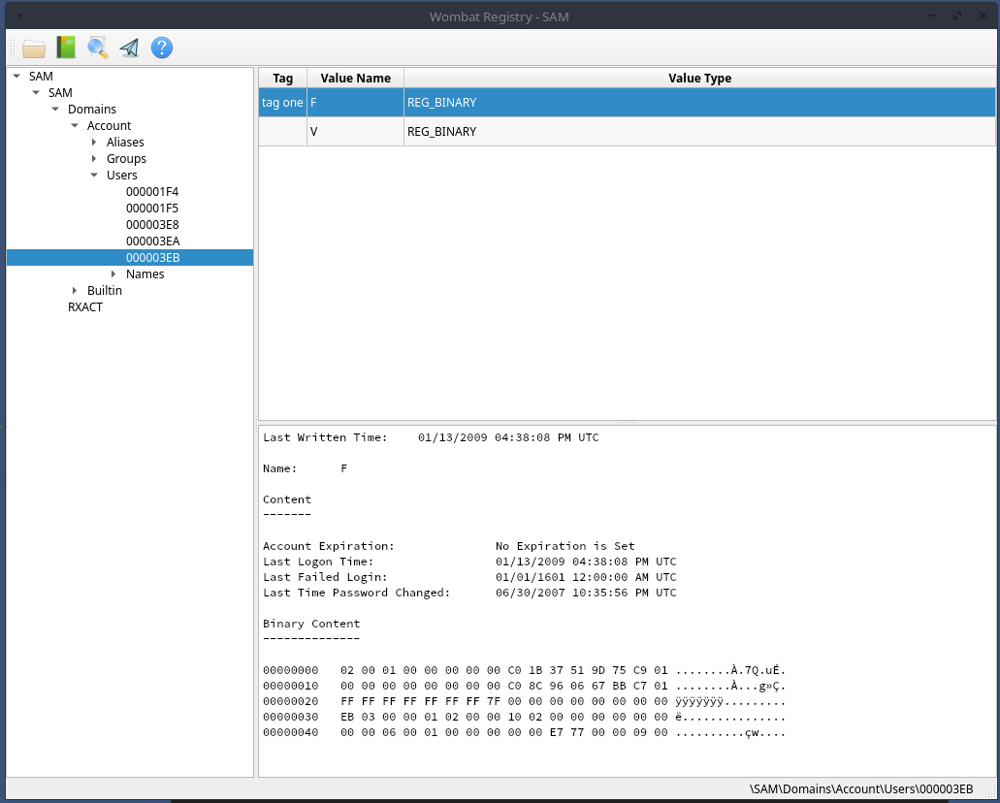

# Wombat Registry
Stand Alone Version of the Registry Viewer found in Wombat Forensics

I needed a free linux based registry viewer and report generator, so I decoupled the registry viewer from wombat forensics.
The registry parsing is thanks to the [libregf library from Joachim Metz](https://github.com/libyal/libregf).
On top of using his library to parse the registry artifacts, I added the ability to tag individual values for inclusion in a report.
I also auto parse a few common registry keys/values and am happy to autoparse more upon request.

This tool is closer to yaru for it's display and I like the fine grained reporting better than other registry tools.
You can preview the report as you build it, so you don't have to keep publishing or exporting to see what it looks like.
There is tag management if you like to create your tags ahead of time rather than name them as you add them.
Plus it runs on linux and is open source and free.

It is a pretty simple and straightforward tool.
The libregf library is dynamically linked, so you will have to build this library and ensure it is in your path first.

Screenshot of the main window

