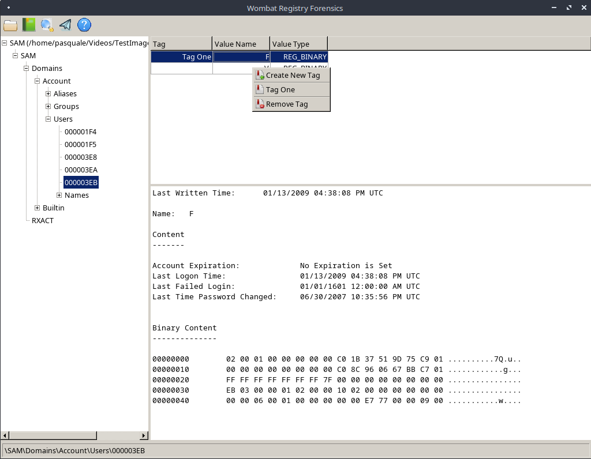

# Wombat Registry
Stand Alone Version of the Registry Viewer found in Wombat Forensics

I needed a free linux based registry viewer and report generator, so I decoupled the registry viewer from wombat forensics.
The registry parsing is thanks to the [libregf library from Joachim Metz](https://github.com/libyal/libregf).
On top of using his library to parse the registry artifacts, I added the ability to tag individual values for inclusion in a report.
I also auto parse a few common registry keys/values and am happy to autoparse more upon request.

## Repository Change
* I am no longer building code on github. I have moved my code to the website www.wombatforensics.com and am hosting my repositories on a vps using fossil for the repositories rather than git. I decided to stop using github due to all the AI crap and scraping code. My code isn't fancy or great, and it is free, but I just don't like the idea of scraping without my ok and since github is free, that is part of the price for free access. So I am leaving the historical bits of my repositories, but moving them all to fossil repositories. Feel free to check them out, they aren't as fancy or featureful as github, but it fits my needs.

This tool is closer to yaru for it's display and I like the fine grained reporting better than other registry tools.
You can preview the report as you build it, so you don't have to keep publishing or exporting to see what it looks like.
There is tag management if you like to create your tags ahead of time rather than name them as you add them.
Plus it runs on linux and is open source and free.

It is a pretty simple and straightforward tool.
The libregf library and fox toolkit library are statically compiled into the program, so it should run if you download the binary.
If you want to compile from source, you will have to download libregf and the fox-toolkit library and compile those prior to compiling wombat registry. To compile, simply run "make wombatregistry" and that should create the executable, then you just have to copy it to your /usr/local/bin/ folder.

Screenshot of the main window

